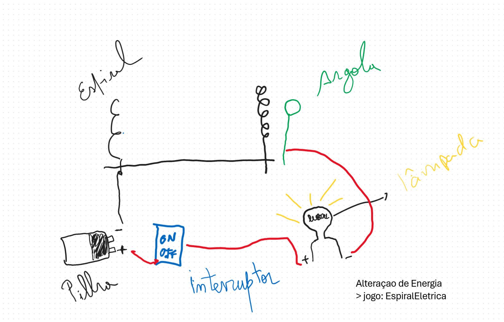
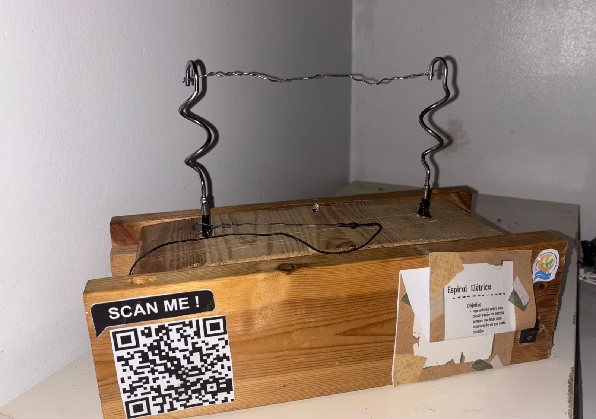

# EspiralElétrica 
Conservação de Energia

Objetivo:
Criar um artefacto, que recrie a conservação de energia sempre haja uma intervenção de um curto circuito.

## Criamos um jogo "Espiral Elétrica"

Objetivo, usar a argola e atravessar uma das espirais desde cima para baixo e subir novamente sem tocar.  

## Componentes:
- Fonte de alimentação (pilha) 9v  
- Lâmpada (recliclada apartir das luzes de natal)  
- Interruptor de um computador antigo  
- Fios de outros equipamentos eletrônicos  
- Arames de ferro (argola)  
- Espirais de ferro do batedor de bolos  
- Estrutura de madeira (pedaços de um beliche de madeira)  
- Fita adesiva isoladora  

## Como jogar:

1 - Ligar o Circuito  
2 - Segurar a argola  
3 - Escollher uma das espirais  
4 - Passar as curvas da espiral sem tocar com a argola  
5 - Todas as vezes que tocar na espiral com a argola a lâmpada acende  
6 - Perdes o Jogo sempre que a Luz acender.

Boa Sorte :) 

  

